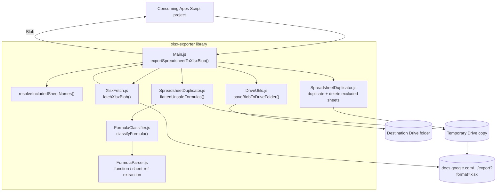

# xlsx-exporter

A Google Apps Script library that exports a Google Sheets spreadsheet to a real `.xlsx` file, automatically detecting formulas that won't survive the trip to Excel and flattening only those to static values — everything else stays a live formula.

## Why

Google Sheets' own "Download as .xlsx" conversion doesn't reliably handle formulas that have no Excel equivalent: custom Apps Script functions, `IMPORTRANGE`, `GOOGLEFINANCE`, `QUERY`, etc. often come out broken, blank, or as `#NAME?` errors. This library pre-processes those specific cells — replacing them with their last computed value — before generating the export, so the resulting file has no data loss.

It also solves a related problem: if you export only a subset of sheets and a formula on an included sheet references data on an excluded sheet, that formula would otherwise break (`#REF!`) in the export. This library detects that case and flattens it to a static value too.

## Deploying the library

1. Open the project in the Apps Script editor (`clasp open`, or push first with `clasp push` if you've made local changes).
2. **Deploy > New deployment**, select type **Library**, and create the deployment. Note the **Script ID** shown under **Project Settings** (also the `scriptId` in this repo's `.clasp.json`).
3. Each time you change the library's code, cut a new deployment version (or a new deployment) — consuming projects pin to a specific version number, so old versions keep working until the consumer explicitly updates.

## Connecting the library in another project

1. In the consuming project's Apps Script editor: **Libraries** (left sidebar) > **Add a library**.
2. Paste the library's Script ID, click **Look up**, pick the version to use, and set an identifier (e.g. `XlsxExporter`) — this identifier is the namespace you'll call functions through.
3. Add the [required scopes](#required-scopes-in-the-consuming-project) below to the consuming project's own `appsscript.json` — the library's own manifest scopes are not inherited automatically.

## Usage

```js
// Export everything
const blob = XlsxExporter.exportSpreadsheetToXlsxBlob({ spreadsheetId: '...' });

// Export only specific sheets
const blob = XlsxExporter.exportSpreadsheetToXlsxBlob({
  spreadsheetId: '...',
  includeSheets: ['Summary', 'Data'],
});

// Export everything except some sheets, saving directly to Drive
const file = XlsxExporter.exportSpreadsheetToXlsxFile(
  { spreadsheetId: '...', excludeSheets: ['Internal Notes'] },
  'DRIVE_FOLDER_ID'
);
```

`includeSheets` and `excludeSheets` are mutually exclusive — pass at most one. Passing neither exports every sheet. The exported file name is always the spreadsheet's name (or the `fileName` option, if given) with the current date/time appended in `DD.MM.YYYY HH:MM` format, using the source spreadsheet's own time zone.

### Required scopes in the consuming project

Apps Script's automatic scope detection only scans a project's own code, not the code of libraries it depends on. Any project that adds this library as a dependency must **also** declare these scopes in its own `appsscript.json`, or calls into this library will fail with an authorization error:

```json
"oauthScopes": [
  "https://www.googleapis.com/auth/spreadsheets",
  "https://www.googleapis.com/auth/drive",
  "https://www.googleapis.com/auth/script.external_request"
]
```

## Formula classification

Every formula in an included sheet is classified as:

- **SAFE** — kept as a live formula in the export. Anything using only standard functions with a direct Excel equivalent (`SUM`, `VLOOKUP`, `IF`, ...) and not referencing an excluded sheet.
- **UNSAFE** — flattened to its last computed static value. This covers:
  - Google-Sheets-only functions with no Excel equivalent (`IMPORTRANGE`, `GOOGLEFINANCE`, `GOOGLETRANSLATE`, `QUERY`, `IMPORTHTML`/`IMPORTXML`/`IMPORTDATA`/`IMPORTFEED`, `SPARKLINE`, ...).
  - Dynamic/spill-producing functions (`INDIRECT`, `SORT`, `UNIQUE`, `FILTER`, `SEQUENCE`, `RANDARRAY`, `ARRAYFORMULA`) — always flattened, since their target/output shape can't be statically verified.
  - Any function name not recognized as a standard Excel-compatible function — this is what catches custom Apps Script functions without needing to enumerate them.
  - Any formula referencing (directly or via a named range) a sheet that's excluded from the export.

The known-safe function list and the two blocklists live in `FormulaClassifier.js` as the single source of truth — extend them there if testing turns up a false positive.

**Known limitation**: a sheet name embedded inside a text argument (e.g. a `QUERY` criteria string) isn't detected by the regex-based reference scanner — but `QUERY` itself is always unsafe, so this doesn't cause data loss in practice.

## How export actually happens

The source spreadsheet is **never mutated**. The library duplicates it in Drive, deletes the excluded sheets from the copy, flattens unsafe-formula cells in the copy (writing values read from the untouched source, not the copy — this is what keeps a formula referencing a just-deleted sheet correct instead of showing `#REF!`), fetches the real `.xlsx` bytes via Google's native `/export?format=xlsx` endpoint, then deletes the temporary copy (retrying on transient failures).

Because Apps Script can hard-kill an execution (the 6-minute timeout, or a manual stop from the Executions dashboard) without ever running its `finally` block, a temp copy can occasionally be left behind with no code able to clean it up. Every export call opportunistically sweeps the source file's parent folders for its own leftover `__xlsx_export_tmp__`-prefixed copies older than 15 minutes and trashes them, so orphans from a previous killed run get cleaned up on the next export rather than accumulating indefinitely.

Only cells holding their own **safe** live formula are left untouched. Every other non-blank cell is rewritten from the source value — this includes unsafe-formula cells, but also any cell with no formula of its own, because that's indistinguishable from a manually-typed literal without a formula engine: it could just as easily be the visual result of an array-producing formula anchored elsewhere (`ARRAYFORMULA`, `QUERY`, `SORT`, `IMPORTRANGE`, ...) spilling into it. Such spilled cells hold no real content — the moment their anchor is flattened from a formula into a literal, Sheets drops the spill and they go blank. Always rewriting them from the source's already-captured value prevents that data loss; rewriting an actual literal with its own unchanged value is a harmless no-op.

Each rewritten cell also has its data validation rule cleared before the value is written: Sheets enforces "reject invalid input" validation on programmatic writes too, and a rule sourced from a range on a just-deleted excluded sheet (or one that simply doesn't accept the flattened value's type) would otherwise make the write throw.



Because `IMPORTRANGE` cells are always classified unsafe, the library never depends on the temporary Drive copy's own (unauthorized — a Drive copy is a new file ID, so it starts without `IMPORTRANGE` access grants) evaluation of that formula; the static value written into the copy always comes from the already-authorized source spreadsheet.

## Testing

There's no automated test framework in Apps Script. `Test.js` has `testEndToEndExport()`, which you run directly from the Apps Script editor: fill in a scratch spreadsheet ID and destination Drive folder ID, then run it and open the result to verify sheet contents match expectations.

Suggested scratch spreadsheet layout for a thorough check: a `Data` sheet with safe formulas, a `Custom` sheet with a real custom Apps Script function, an `External` sheet with `IMPORTRANGE`, a `Summary` sheet with a formula referencing `Data!`, a formula/named range referencing a sheet you'll exclude, and an `ARRAYFORMULA` spilling across multiple rows/columns, and an `Excluded` sheet. Confirm: the excluded sheet is absent from the export; safe formulas are still live; `IMPORTRANGE`/custom-function/excluded-referencing cells and the full extent of the `ARRAYFORMULA`'s spilled output are static values, not blank or errored; and the original spreadsheet is completely unchanged afterward.
